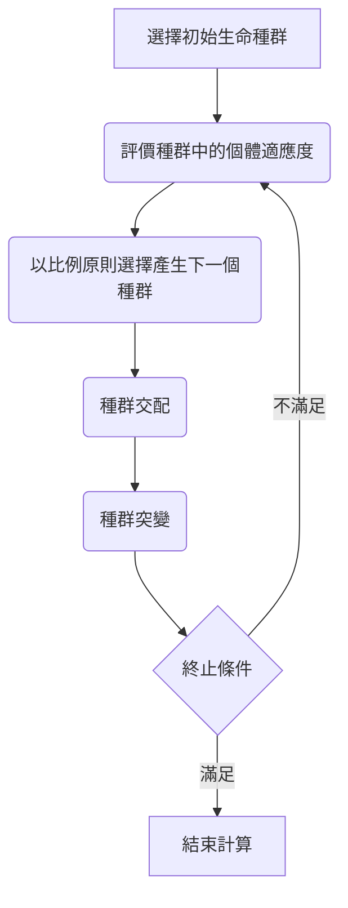

## 1D Case
* Two Interacting Blast Waves Problem
  * GUI : 介面版本  
    makefile指令
    * make : 首次執行須先執行一次make指令將solver轉檔
    * make GUI : 開啟介面
  * QLearning : 使用QLearning最佳化  
    makefile指令
    * make : 將solver轉檔與執行主程式
    * make ref : 建立reference data
    * make run : 使用nohup指令於背景執行  
## 2D Case
* Detonation Waves Case 
* Blunt-Body Flow Case  
  Python 指令
  * python set : 開啟設定參數介面
  * python run : 執行程式
## PDE
* Optimization of Pulse Detonation Engines
  * QLearning : 使用QLearning最佳化
  * DQN : 使用Deep Q Network最佳化
  makefile指令
    * make :將solver轉檔與執行主程式
    * make run : 使用nohup指令於背景執行  
## Genetic Algorithm

## References
* [Morvan](https://mofanpy.com/)  
* [Hung-yi Lee](https://www.youtube.com/channel/UC2ggjtuuWvxrHHHiaDH1dlQ)  
* [Tech With Tim](https://www.youtube.com/channel/UC4JX40jDee_tINbkjycV4Sg)  
* [Python Engineer](https://www.youtube.com/channel/UCbXgNpp0jedKWcQiULLbDTA)  
* [Codemy.com](https://www.youtube.com/channel/UCFB0dxMudkws1q8w5NJEAmw)  
